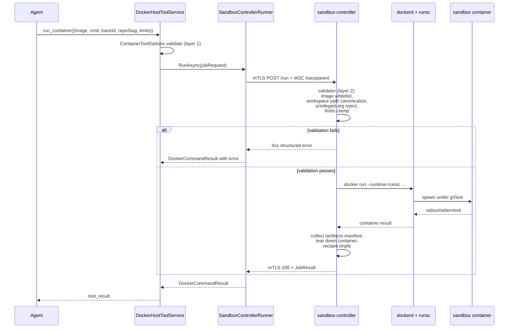

# Sandbox Controller — Architecture and Threat Model

**Status:** Draft (sc-527, epic 526). This document is the authoritative reference for the sandbox-controller implementation. Subsequent slices (sc-528 .. sc-539) refer back to specific sections here for their requirements.

**Audience:** CodeFlow engineers implementing the controller; reviewers asked to sign off on the design; ops at Iron Mountain who will run it.

**Reading order:** [§2 Context](#2-context) and [§4 Threat Model](#4-threat-model) explain *why*. [§5 Phase 1](#5-phase-1-architecturesame-vm-hardened-controller) and [§6 Phase 2](#6-phase-2-architectureseparate-executor-vm) explain *what*. The remaining sections specify *how* in enough detail that the implementation slices have no architectural questions to answer.

---

## 1. Purpose

CodeFlow's `run_container` agent tool needs a real backend in the public-internet-exposed proof-of-concept deployment at Iron Mountain. The naive answer (Docker-out-of-Docker on the api/worker containers themselves) is unsafe for this threat model. This document specifies the alternative: a separate, minimal **sandbox controller** service that is the only component with docker-daemon access, with sandbox jobs running under kernel-level isolation (gVisor).

The design is delivered in two phases:

- **Phase 1 (active):** controller runs as a sibling compose service on the same VM as the rest of the CodeFlow stack. Application-layer code is finalised and ships under this topology.
- **Phase 2 (graduation):** controller moves to its own VM. No application-layer changes; only deploy topology and storage transport differ.

Implementation slices `sc-527` through `sc-538` deliver Phase 1. Slice `sc-539` delivers Phase 2 once the POC is approved and infra is funded.

---

## 2. Context

### 2.1 What `run_container` is

CodeFlow workflows can include nodes that drive an agent. Agents have access to a tool surface configured per role. One of those tools is `run_container` — given an image, command, and a workspace path, it runs a container, captures stdout/stderr/exit code, and returns the result to the agent. Use cases include compiling and testing the code in a per-trace workspace, running linters, and any agent-supervised build step.

Today, `run_container` is implemented in `CodeFlow.Runtime/Container/DockerHostToolService.cs` and ultimately invokes the `docker` CLI through `IDockerCommandRunner`. The validator in `CodeFlow.Runtime/Container/ContainerToolOptions.cs` enforces:

- `AllowedImageRegistries` whitelist
- `AllowPrivileged`, `AllowDockerSocketMount`, `AllowHostNetwork`, `AllowPublishedPorts`, `AllowDockerSocketMount` all forced to `false`
- CPU, memory, pids, timeout, and output-size caps
- `WorkspaceMountPath` constrained to a single absolute path inside the container

The validator is correct and stays in place under this design. What changes is the *transport* — instead of the api/worker invoking `docker` themselves, they call the controller.

### 2.2 Deployment context

Iron Mountain hosts the POC on a single VM (`codeflow.trefry.net`), reachable from the public internet via Caddy with OAuth/Keycloak authentication at `identity.trefry.net`. The compose stack is captured in `deploy/docker-compose.prod.yml` and contains `codeflow-api`, `codeflow-worker`, `codeflow-ui`, and an `codeflow-init` chown helper. RabbitMQ and MariaDB are external on `trefry-network`.

In the current production deploy, neither api nor worker has the docker CLI installed and neither mounts the host's docker socket. As a consequence, `run_container` is inert — every invocation surfaces "docker not available" to the agent, and the hourly `ContainerResourceSweepService` was logging a warning every cycle until [PR #208](https://github.com/michaeltrefry/CodeFlow/pull/208) added a specific `DockerCliNotAvailableException` that lets the sweep service exit cleanly when the binary is missing. The noise stopped; the underlying capability still doesn't work in prod. This epic fixes that, properly.

---

## 3. Goals and non-goals

### 3.1 Goals

1. CodeFlow `codeflow-api`, `codeflow-worker`, and `codeflow-ui` containers ship without the `docker` CLI and without `/var/run/docker.sock` mounted. **Permanently** — across both phases of this epic and forever after.
2. Agent-driven container jobs flow through the controller's narrow API only. There is no second path that bypasses the controller.
3. Each sandbox job runs under a **kernel-isolated** runtime (gVisor `runsc`). Linux namespaces alone are not the security boundary.
4. Defense in depth: CodeFlow's existing `ContainerToolOptions` validator stays in place; the controller adds an **independent** validator that re-checks every claim. Neither layer trusts the other.
5. Workspaces mount **read-only** with a writable overlay for build outputs. Per-job results are captured and returned via an artifacts manifest.
6. mTLS is required for every controller call across both phases. There is no environment in which the controller accepts plaintext or unauthenticated traffic, including local development (self-signed dev CA).
7. End-to-end observability: controller emits OTLP traces and metrics; W3C trace context propagates from the agent's tool call through to per-container span attributes.
8. Phase 1 deploys to the existing CodeFlow VM as a sibling compose service. Phase 2 graduates to a separate VM with **no application-layer changes** — only deploy topology and storage transport.

### 3.2 Non-goals (for this epic)

- Per-tenant isolation of executor capacity. The multi-tenant pivot lives in the separate `codeflow-team` repo (epic 238) and will need stronger isolation (per-tenant daemons, Firecracker microVMs per tenant, or a managed sandbox vendor). This epic delivers a single shared executor adequate for single-tenant prod.
- Replacing local-docker development. `ContainerTools:Backend ∈ { Docker, SandboxController }`. `Docker` stays as the dev-only backend; `SandboxController` is the prod backend across both phases.
- Rewriting `DockerHostToolService` or the `run_container` tool schema. The C# tool layer stays; only the runner swaps.
- Kata Containers / Firecracker microVMs as the per-job runtime. gVisor first; Kata is a future option.
- Egress policy nuance for sandbox network traffic. v1: no network in the sandbox by default. Image pulls go through the controller's daemon, not through the sandbox.
- Signed-image / SBOM gating. The image whitelist is the v1 control.

---

## 4. Threat Model

### 4.1 Assets to protect

| Asset | Where it lives | Confidentiality | Integrity | Availability |
|---|---|---|---|---|
| OAuth client secrets, OpenAI/Anthropic API keys, Secrets__MasterKey | `.env.release` on CodeFlow VM | Critical | Critical | Medium |
| MariaDB on `trefry-network` (workflows, traces, audit log) | external host | High | Critical | High |
| Per-trace repo workspaces | host disk (`/opt/codeflow/workdirs`) | Medium | High | Medium |
| Customer / partner data | none yet (POC) | n/a | n/a | n/a |
| Public reputation of the POC | the POC itself | n/a | High | Medium |

### 4.2 Adversaries in scope

1. **Opportunistic external attacker.** Reaches the public surface (`codeflow.trefry.net`); no insider access; tries common web exploits, OAuth-flow tampering, header injection, deserialisation, supply-chain CVEs against the .NET dependencies.
2. **Hijacked agent input.** Prompt injection, malicious workflow definitions, malicious repo contents that an agent then runs commands against. The attacker controls some text the agent reads but does not control the .NET process directly.
3. **Compromised dependency.** A NuGet or npm package the build pulls in turns malicious. Exploit runs at .NET-process or UI-bundle privilege.
4. **Accidental misuse by a legitimate user.** Authenticated user crafts a workflow that does something it shouldn't (e.g. tries to mount the host root, tries to pull an arbitrary image, tries to use the sandbox to scan internal IPs).

### 4.3 Adversaries explicitly out of scope

- **Iron Mountain ops insider with VM root.** If the host is rooted, this design doesn't help. That's not a threat we can mitigate at the application layer.
- **Compromise of the OAuth provider** (`identity.trefry.net`). Out of scope; defended by the OAuth deployment epic.
- **Physical access to the IM VM.** Out of scope.

### 4.4 Trust boundaries

```
   ┌─────────────────────┐
   │  public internet    │
   └──────────┬──────────┘
              │  TLS, OAuth (Keycloak)
              │  ── BOUNDARY 1 ──────────────────────────────────
   ┌──────────▼──────────┐
   │  codeflow-api / ui  │  .NET app tier; large attack surface
   │  codeflow-worker    │  agent loops, MCP, MassTransit, EF, Scriban
   └──────────┬──────────┘
              │  mTLS over `controller-internal` compose network
              │  ── BOUNDARY 2 (this epic's headline contribution) ──
   ┌──────────▼──────────┐
   │ sandbox-controller  │  small Go binary, hardened deploy
   └──────────┬──────────┘
              │  unix socket
              │  ── BOUNDARY 3 ──────────────────────────────────
   ┌──────────▼──────────┐
   │      dockerd        │  the only thing on the host with root-equiv
   │     + runsc         │
   └──────────┬──────────┘
              │  spawns
              │  ── BOUNDARY 4 (gVisor userspace kernel) ─────────
   ┌──────────▼──────────┐
   │ sandbox container   │  per-job; runs the agent's command
   └─────────────────────┘
```

### 4.5 Compromise budget per layer

For each layer, what does an attacker who has fully compromised that layer have, and what stops them from going further?

| Compromised layer | What they have | What stops them |
|---|---|---|
| Public internet | Whatever Caddy and Keycloak let through | OAuth + audience check + CORS + WAF behaviour at Caddy |
| api / worker / ui process (Boundary 1 fail) | Read .NET process memory, issue mTLS-authenticated calls to controller, query MariaDB, call OpenAI/Anthropic, talk to RabbitMQ | Controller's independent validator; mTLS subject pin; image whitelist; no docker access from here |
| Controller process (Boundary 2 fail) | Talk directly to dockerd over the socket, bypassing the validator | **Phase 1: nothing — host-root.** This is the residual risk; mitigated only by minimising controller attack surface (sc-538). **Phase 2: limited to executor VM** — CodeFlow VM unaffected |
| dockerd / kernel (Boundary 3 fail) | Host root | Out of scope — this is the host itself |
| Sandbox container (Boundary 4 fail) | Inside gVisor's userspace kernel; no host syscalls | gVisor runsc — bug-class limited to gVisor escapes, not generic Linux kernel CVEs |

### 4.6 The path that matters most

In a typical web-app threat model, the high-probability events are layer-1 compromise (web vulnerability) and layer-2 compromise (chained exploit through a deserialiser or an .NET supply-chain vuln). The controller pattern is specifically designed to make those events **not** result in host-root.

The path "compromise the controller itself" is much lower probability because the controller has a tiny attack surface — a Go static binary, mTLS-only, with a single narrow API. Every defensive lever the deploy can apply is applied (sc-538). On Phase 1, this is still a host-root path; on Phase 2 it's not. Until graduation, the controller's smallness is the mitigation.

---

## 5. Why DooD on the app tier is rejected

A simpler answer than this design exists on paper: bundle the docker CLI into the api/worker images, mount `/var/run/docker.sock` from the host, give the app uid the docker group's gid. We considered and rejected it for the following reasons:

1. **One layer-1 compromise = host-root.** The docker daemon runs as root on the host; the socket is its API; whoever can reach the socket can ask it to do anything, including `docker run -v /:/host --privileged ...` to root the host. CodeFlow's `ContainerToolOptions` validator is bypassed by anything running inside the .NET process — a deserialisation gadget, a Scriban template escape, a NuGet supply-chain payload, an MCP server response that exploits a parser bug. Any of those events go straight from "untrusted input" to "host-root."

2. **The validator's threat model assumes app integrity.** `ContainerToolOptions.Validate()` runs *inside* the .NET process. It is a check on what the app *intentionally* asks docker to do. It is not a check on what an attacker who has the .NET process under their control can ask docker to do.

3. **The api is a high-value, internet-facing surface.** The api hosts public OAuth flows, the assistant chat loop, MCP client connections to arbitrary servers, EF Core query construction, MassTransit consumers handling RabbitMQ messages, and Scriban template execution. The exploit surface is not small. Putting host-root one layer-1-bug away from that surface is an unforced security error.

4. **Industry guidance is unambiguous.** The CIS Docker Benchmark, OWASP Container Security guidance, and the Docker docs all explicitly call out socket-mount-into-public-service as the canonical anti-pattern. A reviewer asked to sign off on this design would point at exactly this section.

The controller pattern (Phase 1) preserves the same convenience — running on one VM, no second machine to manage — while moving the socket out of the app's blast radius. Phase 2 finishes the job by moving the controller off the same machine entirely.

---

## 6. Phase 1 Architecture — Same-VM Hardened Controller

### 6.1 Component diagram

```
┌────────────────────────────────────────────────────────────────────┐
│  Iron Mountain — single VM (codeflow.trefry.net)                   │
│                                                                    │
│  ┌─ default + trefry-network ────┐  ┌─ controller-internal ────┐   │
│  │                               │  │  (internal: true)        │   │
│  │  codeflow-ui    (Caddy front) │  │                          │   │
│  │  codeflow-api   (Caddy front) ├──┼──> codeflow-sandbox-     │   │
│  │  codeflow-worker              ├──┼─────► controller         │   │
│  │                               │  │                          │   │
│  └──────────────────────────────┬┘  └──────────┬───────────────┘   │
│                                 │              │                   │
│                          host bind-mount       │                   │
│                       /opt/codeflow/workdirs   │                   │
│                                 │              │                   │
│                                 │       /var/run/docker.sock       │
│                                 │              │                   │
│                                 ▼              ▼                   │
│                          ┌──────────────────────────────┐          │
│                          │   host: dockerd + runsc      │          │
│                          └─────────────┬────────────────┘          │
│                                        │ spawns sibling            │
│                                        ▼                           │
│                          ┌──────────────────────────────┐          │
│                          │  sandbox container           │          │
│                          │  --runtime=runsc             │          │
│                          │  --network=none              │          │
│                          │  --read-only                 │          │
│                          │  /workspace (rw — per-trace) │          │
│                          │  /workspace/.scratch (tmpfs) │          │
│                          │  /artifacts (rw, per-job)    │          │
│                          └──────────────────────────────┘          │
└────────────────────────────────────────────────────────────────────┘
```

### 6.2 Networks

Three compose networks:

- **`default`** — existing per-stack network. Carries general inter-service traffic.
- **`trefry-network`** — existing external network. Connects to MariaDB and RabbitMQ.
- **`controller-internal`** — **new**, declared with `internal: true`. The controller and api/worker (only) attach to this. UI does not — it has no business calling the controller. `internal: true` prevents docker from creating a NAT rule for outbound traffic, which means the controller has **no public-internet egress**. (Image pulls happen from dockerd's perspective, not from inside the controller container.)

The controller is **not published to the host**. There is no `ports:` directive on its compose service. From outside the compose network it does not exist.

### 6.3 The controller container's runtime posture

Specified in detail in sc-538. Summary:

- Image: distroless static (`gcr.io/distroless/static:nonroot`), Go binary built with `CGO_ENABLED=0`, image size < 30 MB.
- `read_only: true`
- `cap_drop: [ALL]`
- `security_opt: [no-new-privileges:true, apparmor=codeflow-sandbox-controller, seccomp=./controller-seccomp.json]`
- `user: 65532:65532` (distroless `nonroot`)
- `tmpfs: /tmp:size=16m,mode=1700`
- Volumes:
  - `/var/run/docker.sock:/var/run/docker.sock` (the only privilege; mode 0660; docker GID supplied via `group_add`)
  - `/opt/codeflow/workdirs:/workspace:ro` (read-only from the controller's perspective — the controller does not write to the workspace; it passes the path to dockerd, which re-mounts the per-trace subdir into the sandbox writable)
  - Cert material from secrets (read-only)
  - Config from secrets (read-only)
- No published ports.

### 6.4 Sibling sandbox container settings

When the controller spawns a sibling container via dockerd, every container is created with:

- `--runtime=runsc` (gVisor)
- `--network=none` (no network access at all by default)
- `--read-only` (root filesystem is read-only)
- `--tmpfs=/tmp:size=64m`
- `--user=65534:65534` (`nobody` — controller's policy, not the image's default)
- `--cap-drop=ALL`
- `--security-opt=no-new-privileges:true`
- `--pids-limit=N` (from request, capped by controller config)
- `--memory=N`, `--cpus=N` (from request, capped)
- Workspace: `-v /workspace/{traceId}:/workspace:rw` (the host path resolves under the controller's `workdir_root`, default `/workspace`; the per-trace subdir is the agent's writable workspace, the same directory the worker's host tools mutate via `read_file`/`apply_patch`/`run_command`/`vcs.clone`)
- Workspace scratch: `--tmpfs=/workspace/.scratch:rw,exec,size=2g` (ephemeral fast space for build artifacts the agent doesn't want surviving the job — workspace itself is also writable but is persisted for the duration of the trace)
- Artifacts: `-v /workspace/{traceId}/.results/{jobId}:/artifacts:rw`
- Label: `cf-managed=true`, `cf.traceId={traceId}`, `cf.jobId={jobId}` (for orphan sweep)

The controller validates that no request can override any of these — see [§10 Validators](#10-validators-defense-in-depth).

---

## 7. Phase 2 Architecture — Separate Executor VM

Phase 2 graduates the controller to its own VM. The picture is the same, drawn larger:

```
┌─────────────── Iron Mountain network ──────────────────────────────┐
│                                                                    │
│  ┌── CodeFlow VM ───────────┐    ┌── Executor VM ──────────────┐   │
│  │  codeflow-api            │    │  codeflow-sandbox-controller│   │
│  │  codeflow-worker         │    │  (same image, same flags)   │   │
│  │  codeflow-ui             │    │                             │   │
│  │                          │    │   /var/run/docker.sock      │   │
│  │   ╭───────────────╮      │    │           │                 │   │
│  │   │ NFS client mt │◄─────┼────┼───────►   │                 │   │
│  │   │ /opt/codeflow │      │    │           ▼                 │   │
│  │   │   /workdirs   │      │mTLS│   ┌───────────────────┐     │   │
│  │   ╰───────┬───────╯      ├───►├───┤ dockerd + runsc   │     │   │
│  │           │              │    │   └────────┬──────────┘     │   │
│  └───────────┼──────────────┘    │            │                │   │
│              │                   │            ▼                │   │
│              │                   │   ┌─────────────────────┐   │   │
│              │                   │   │ sandbox container   │   │   │
│              │                   │   │ (gVisor)            │   │   │
│              │                   │   └────────┬────────────┘   │   │
│              │                   │            │                │   │
│              │                   │   ╭────────▼────────╮       │   │
│              │                   │   │ NFS client mt   │       │   │
│              ▼                   │   │ /mnt/codeflow-  │       │   │
│         ┌─────────┐               │   │   workdirs      │       │   │
│         │  NFS    │◄──────────────┼───┤                 │       │   │
│         │ server  │               │   ╰─────────────────╯       │   │
│         │ (or IM  │               │                             │   │
│         │  share) │               └─────────────────────────────┘   │
│         └─────────┘                                                 │
└────────────────────────────────────────────────────────────────────┘
```

### 7.1 What changes between Phase 1 and Phase 2

| Concern | Phase 1 | Phase 2 |
|---|---|---|
| Controller location | Compose service on CodeFlow VM | Compose service on Executor VM |
| Network from api/worker → controller | `controller-internal` compose network | mTLS over IM internal network |
| Workspace storage | Host bind-mount on CodeFlow VM | Shared NFS mount on both VMs |
| docker daemon location | CodeFlow VM | Executor VM |
| gVisor location | CodeFlow VM | Executor VM |
| mTLS plumbing | Compose secrets, manual rotation | IM secret store, automated rotation |
| Residual host-root risk on controller compromise | CodeFlow VM rooted → catastrophic | Executor VM rooted → CodeFlow data still safe |

### 7.2 What does NOT change

| Concern | Phase 1 and Phase 2 |
|---|---|
| `SandboxControllerRunner` C# code | Identical |
| Controller binary | Identical |
| `ContainerTools:Backend` config flag | `SandboxController` in both |
| Controller `POST /run` schema | Identical |
| Validator rules | Identical |
| Image whitelist | Identical |
| Sandbox container settings | Identical |
| Threat-model conformance tests (sc-536) | Run identically against both topologies |

This is the explicit guarantee that makes Phase 2 a deploy-only graduation, not a redesign.

---

## 8. Data Flow — Per-Job Lifecycle



### 8.1 Step-by-step

1. **Agent invokes `run_container`** — tool schema specifies `image`, `cmd[]`, an existing trace's `traceId`, the workspace `repoSlug`, and resource limits within the schema's bounds. The agent cannot specify `privileged`, host network, or socket mounts — those keys are not in the schema.

2. **Layer-1 validation** in `DockerHostToolService` against `ContainerToolOptions`. Image registry whitelist, limits within configured caps, repo slug well-formed.

3. **Runner serialises a `JobRequest`** containing only the fields the controller needs. The request includes a `jobId` (UUIDv7), the `traceId`, `repoSlug`, image reference, command, env, limits, and a per-job timeout.

4. **mTLS POST /run** — the Runner uses .NET `HttpClient` with `SocketsHttpHandler`, presenting its client cert. The controller's TLS config requires client cert and pins the subject. The W3C `traceparent` header propagates the OTel context.

5. **Layer-2 validation** in the controller. *Independent* of layer 1 — the controller does not assume the api/worker have already validated anything. Validator covers:
   - image is on the whitelist
   - resolved workspace path canonicalises under the configured workdir root, no `..`, no symlink-out-of-tree
   - resource limits within configured caps
   - request does not attempt to set privileged, host network, host PID, capabilities-add, additional volumes, or any other dangerous knob
   - if any forbidden field is present in the JSON, the request is rejected even if the field is set to the "safe" value (defense against type confusion / serialiser quirks)

6. **Spawn under gVisor.** Controller invokes the docker daemon over the unix socket with `--runtime=runsc` and the locked-down container settings from §6.4. Resource limits are passed; labels are set.

7. **Wait for exit.** Controller waits up to the per-job timeout. On timeout, the container is force-killed and `TimedOut: true` is returned in the response.

8. **Capture artifacts.** Controller reads the `/artifacts` directory (which lives on host disk at `/opt/codeflow/workdirs/{traceId}/.results/{jobId}/`), enumerates files written by the job, builds an artifacts manifest. Small files can be returned inline in the response; large files are referenced by path for the api/worker to fetch later.

9. **Tear down.** Controller removes the container (`docker rm -f`), the tmpfs is released by the kernel, scratch is gone. The `.results/{jobId}/` dir on host disk persists until the cleanup sweep removes it (configurable TTL).

10. **Response.** mTLS 200 with `JobResult` — exit code, captured stdout/stderr (bounded), truncation flags, timeout flag, artifacts manifest. `SandboxControllerRunner` adapts the response into the existing `DockerCommandResult` shape. `DockerHostToolService` returns to the agent unchanged.

### 8.2 Cancellation

Agent cancellation propagates as `POST /cancel` with the `jobId`. The controller force-kills the container if it's still running and returns 204. Outstanding `/run` calls receive a structured error with `cancelled: true`. Idempotent — cancelling an already-finished job is a no-op 204.

---

## 9. Workspace Transport

The mechanism by which "the code that needs to be built and tested" reaches the sandbox.

### 9.1 Phase 1: host bind-mount

- Worker writes per-trace repo checkouts to `/workspace/{traceId:N}/...` inside its container, which bind-mounts from `${CODEFLOW_WORKDIRS_DIR:-/opt/codeflow/workdirs}` on the host (existing config in `deploy/docker-compose.prod.yml`). Repos can be pre-populated by the runtime or cloned by the agent via the `vcs.clone` host tool — both paths resolve to the same per-trace directory.
- Sandbox-controller container has `${CODEFLOW_WORKDIRS_DIR:-/opt/codeflow/workdirs}:/workspace:ro` mounted — read-only **from the controller's perspective**, because the controller doesn't write to workspaces; it just hands the path to dockerd. The controller's `workdir_root` config matches that in-container path (`/workspace`).
- When dockerd spawns a sibling container, the bind-mount source path is the **host path** (`${CODEFLOW_WORKDIRS_DIR}/{traceId}`), because dockerd's mount semantics resolve relative to the host filesystem, not the controller container's view. dockerd re-mounts that subdir into the sandbox writable so the agent can mutate its own trace's files.
- Sandbox container sees:
  - `/workspace` — **read-write**, the per-trace workdir; agents in `code-worker`/`code-builder` roles use `vcs.clone` + `apply_patch` + `run_command` here, and `container.run` builds/tests pick up edits the agent already made
  - `/workspace/.scratch` — tmpfs, writable; size-capped (default 2 GB). Useful for ephemeral build caches the agent doesn't need to persist
  - `/artifacts` — writable bind to `${CODEFLOW_WORKDIRS_DIR}/{traceId}/.results/{jobId}/` for declared outputs

### 9.2 Phase 2: NFS mount

- Both VMs mount the same NFS export at the same canonical path (recommended: align both at `${CODEFLOW_WORKDIRS_DIR}` mounted at `/workspace` so no config in api/worker/controller changes between phases).
- NFS export options: `rw,sync,no_subtree_check,root_squash` — explicitly NOT `no_root_squash`. Squash means root-on-client cannot escalate via NFS.
- Worker writes from CodeFlow VM; controller reads-and-passes-as-bind-mount from Executor VM. Same code path on the controller side.

### 9.3 Path validation

The controller's validator enforces:

```go
// Pseudocode — implementation in sc-531.
func (v *Validator) validateWorkspacePath(traceId, repoSlug string) (string, error) {
    candidate := filepath.Join(v.workdirRoot, normaliseN(traceId), repoSlug)
    resolved, err := filepath.EvalSymlinks(candidate)
    if err != nil {
        return "", fmt.Errorf("workspace_invalid: %w", err)
    }
    if !strings.HasPrefix(resolved+string(filepath.Separator), v.workdirRoot+string(filepath.Separator)) {
        return "", errors.New("workspace_invalid: path escapes configured root")
    }
    if info, err := os.Stat(resolved); err != nil || !info.IsDir() {
        return "", errors.New("workspace_invalid: path is not an existing directory")
    }
    return resolved, nil
}
```

Test coverage in sc-536 includes:

- `traceId` containing `..` rejected
- `repoSlug` containing `..` or path separators rejected
- workspace dir containing a symlink to `/etc` rejected
- workspace dir that doesn't exist rejected
- TOCTOU resilience: the resolved path is the one passed to dockerd (no second resolve)

### 9.4 Why read-only + tmpfs scratch

A sandbox running an agent's command should not be able to mutate the source the *next* job will read. Two failure modes this defends against:

- A buggy or hostile build step writes to `/workspace/Tests/Foo.cs`. The next agent invocation now sees code an earlier job wrote — silent corruption of replay semantics.
- An exploit in the build step (e.g. malicious test runner CVE) attempts to write a backdoor into the workspace. Read-only mount means the write fails before reaching disk.

Build outputs go to the tmpfs at `/workspace/.scratch`, which is per-job and discarded on tear-down. Declared outputs (junit XML, coverage, etc.) go to `/artifacts`, which is the only writable on-disk path the job has, scoped to that job's results dir.

### 9.5 Unit-test specifics

For `dotnet test` workflows the agent's `cmd` typically looks like:

```
dotnet test \
  --logger "trx;LogFilePrefix=tests" \
  --results-directory /artifacts \
  --collect:"XPlat Code Coverage" \
  /workspace/MySolution.sln
```

Build outputs (`bin/`, `obj/`) accumulate in `/workspace/.scratch/{project}/...` because msbuild's `BaseIntermediateOutputPath` and `BaseOutputPath` are pre-set in the sandbox image's environment to point under `/workspace/.scratch`. (The sandbox base image does this; agent-supplied images can opt out with `dotnet test --output /workspace/.scratch/out` or similar.)

`/artifacts` ends up containing `.trx` files and `coverage.cobertura.xml` files; the controller's artifacts manifest enumerates them and the api/worker can surface them in the trace inspector.

---

## 10. Validators — Defense in Depth

Two independent validators run on every request.

### 10.1 Layer 1 — `ContainerToolOptions` (CodeFlow side)

Already implemented in `CodeFlow.Runtime/Container/ContainerToolOptions.cs`. Stays in place. Enforces:

- Image registry on `AllowedImageRegistries`
- Resource limits within configured caps
- `AllowPrivileged`, `AllowDockerSocketMount`, `AllowHostNetwork`, `AllowPublishedPorts` all forced false
- Workspace mount path syntactically valid

This is the existing tool-level check. Failure modes that this defends against: agent specifying out-of-bounds limits, agent specifying a non-allowlisted registry. Failure modes it does **not** defend against: anything that bypasses this code path (e.g. RCE in the .NET process).

### 10.2 Layer 2 — Controller validator

New, in the controller. Re-checks every claim independently. Source of truth is the controller's own config; the api/worker's claims about what's allowed are not trusted.

Rules enforced:

| Rule | Failure mode | Error code |
|---|---|---|
| Image is on the controller's whitelist | Layer-1 bypass; agent invokes via a non-tool code path | `image_not_allowed` |
| Image reference is well-formed (no `;`, no shell metacharacters) | Argv injection | `image_invalid` |
| Workspace path canonicalises under workdir root | Path traversal | `workspace_invalid` |
| Workspace path resolves through no out-of-tree symlinks | Symlink escape | `workspace_invalid` |
| Resource limits within configured caps | Layer-1 bypass | `limits_exceeded` |
| Request does not contain `privileged`, `cap_add`, `host_network`, `host_pid`, `socket_mount`, or any extra mount field | Schema-bypass / type confusion | `forbidden_field` |
| Request does not contain unknown JSON fields | Future-compat / smuggling defence | `unknown_field` |
| Request size ≤ controller's configured cap | DoS via huge requests | `payload_too_large` |

The "no unknown fields" rule is enforced by JSON-decoding into a strict struct and rejecting extra fields. This catches an entire class of bypass attempts where an attacker adds a field the api/worker's serialiser ignores but the controller's might honor (or vice versa). The contract is: every field that exists is documented; everything else is a 400.

### 10.3 Why both layers

Each layer protects a different scenario:

- Layer 1 protects the agent from accidentally asking for something out-of-bounds. Failure here is most likely a programming error, not an attack.
- Layer 2 protects the host from a compromised api/worker. Failure here means an attacker has reached the .NET process and is now trying to escalate. Layer 2 is the only thing standing between them and dockerd.

Removing either layer is a security regression. Code review should flag any change that disables either.

### 10.4 Validator implementation details

- Written in Go, in the controller. No shared library with C# — intentional. Two implementations make a class of bugs (a shared-library vuln) impossible.
- All rules are testable in isolation. sc-536 covers the conformance tests.
- Validator runs *before* any side effect — no log line, no metric, no docker call happens before validation completes. Logged rejections include the rule name and a hash of the offending field, but never the raw value (defends against log-injection of secrets).

---

## 11. Controller API

### 11.1 Endpoints

- `POST /run` — submit a job; blocking until the job completes or timeout.
- `POST /cancel` — cancel an outstanding job by `jobId`.
- `GET /healthz` — liveness; returns 200 with `{"ok": true}`. **mTLS-required** like everything else; ops monitoring uses an mTLS client cert. Rejecting unauthenticated `/healthz` removes a free reconnaissance endpoint.
- `GET /version` — build metadata, config hash. mTLS-required.

### 11.2 `POST /run` request schema

```json
{
  "jobId": "01951f8d-...",            // UUIDv7 from the caller
  "traceId": "abc123def456...",        // CodeFlow trace; used to compose workspace path
  "repoSlug": "owner-repo-deadbeef",   // CodeFlow per-trace repo dir name
  "image": "ghcr.io/trefry/dotnet-tester:10.0-sdk-alpine",
  "cmd": ["dotnet", "test", "--logger", "trx;..."],
  "env": { "DOTNET_NOLOGO": "1" },     // string-string only; no expansion
  "limits": {
    "cpus": 2.0,
    "memoryBytes": 4294967296,
    "pids": 1024,
    "timeoutSeconds": 1200,
    "stdoutMaxBytes": 2097152,
    "stderrMaxBytes": 2097152
  }
}
```

### 11.3 `POST /run` response schema

```json
{
  "jobId": "01951f8d-...",
  "exitCode": 0,
  "stdout": "...",
  "stderr": "...",
  "stdoutTruncated": false,
  "stderrTruncated": false,
  "timedOut": false,
  "cancelled": false,
  "durationMs": 18234,
  "artifacts": [
    {
      "path": "tests-MySolution.trx",
      "sizeBytes": 18432,
      "kind": "test-results"
    }
  ]
}
```

### 11.4 Error envelope

All non-2xx responses use:

```json
{
  "error": {
    "code": "workspace_invalid",
    "message": "workspace path escapes configured root",
    "rule": "validator.workspacePath",
    "jobId": "01951f8d-..."
  }
}
```

`code` is from a fixed enum (the validator rules in §10.2 plus `controller_unavailable`, `daemon_error`, `internal_error`). Callers can map codes to retry semantics deterministically.

### 11.5 mTLS

- TLS 1.3 minimum. Cipher suites limited to AEAD.
- Server cert: `CN=codeflow-sandbox-controller`. Subject pin allows api/worker to detect a swapped server cert.
- Client cert subjects on the server's allowlist: `CN=codeflow-api,O=trefry`, `CN=codeflow-worker,O=trefry`.
- Internal CA root issues both server and client certs. CA is **internal only**; not chained to any public CA.
- Cert lifetime: 90 days. Rotation runbook in sc-535 (Phase 1) and sc-539 (Phase 2 automation).

---

## 12. Failure Modes

| Failure | Detection | Response |
|---|---|---|
| Controller process down | api/worker mTLS connection error | api/worker surfaces `controller_unavailable` to the agent; tool returns a structured error; trace continues with the failure recorded |
| Controller hangs (deadlock) | api/worker request timeout | client-side timeout fires; api/worker logs and surfaces `controller_unavailable` |
| dockerd down on host | controller's daemon call fails | controller returns `daemon_error`; sweep is paused |
| runsc binary missing or broken | dockerd run-call fails with runtime-not-found | controller returns `daemon_error` with a specific cause; ops alert |
| Image pull fails (registry unreachable) | timeout in dockerd run-call | controller returns `image_pull_failed`; agent can retry or fail the workflow |
| Image not on controller whitelist | layer-2 validator | controller returns 403 `image_not_allowed`; agent sees deterministic rejection |
| mTLS cert expiry | TLS handshake fails | api/worker connection error → `controller_unavailable`; ops gets paged from cert-expiry monitoring (separate alarm) |
| NFS mount fails (Phase 2) | path resolution returns ENOENT | controller returns `workspace_invalid`; ops alerted; sweep paused for `.results/` cleanup |
| Sandbox container exceeds memory cap | OOM-killer | exit code reflects, stderr captures last log lines; agent sees a normal "non-zero exit" tool result |
| Sandbox container hits pids limit | fork failures inside | container exits non-zero; stderr captures |
| Sandbox container exceeds wall-clock timeout | controller-side timer | controller force-kills, returns `timedOut: true` |
| gVisor exits with internal error | sandbox container terminates abnormally | controller returns the abnormal exit; ops alerted on `runsc_internal_error` metric |

### 12.1 Defensive defaults

- The sweep service (sc-533) **pauses** when daemon errors recur, rather than spamming logs every cycle. PR #208's pattern carries over: a single info log on first detection, no further log spam.
- The controller does not retry failed validations; clients retry deliberately if they want to.
- The controller does retry transient docker-daemon errors (e.g. `transport is closing`) up to N times with backoff before surfacing `daemon_error`.

---

## 13. Operational Runbooks (stubs)

Each of these gets a full runbook in the relevant deploy slice. This section captures the inputs needed.

### 13.1 Cert rotation (Phase 1)

- Where the CA root lives (compose secret, IM secret store).
- How to issue a new server cert / new client cert.
- How to roll the api/worker without dropping in-flight requests (deploy new cert, restart worker first since it has no public traffic, then api in a brief blip — Caddy holds connections).
- How to revoke a leaked cert.

### 13.2 Image whitelist updates

- Edit `controller-config.toml` on the host (or in the IM config repo).
- `docker compose kill -s HUP codeflow-sandbox-controller` to trigger reload.
- Verify via `GET /version` showing the new config hash.

### 13.3 NFS provisioning (Phase 2)

- IM-managed share: who to ask, what export options to request.
- Or self-managed NFS server: setup, exports config, monitoring.
- Mount fstab entries on both VMs.
- Cutover playbook from Phase 1 host bind-mount to Phase 2 NFS.

### 13.4 Controller compromise (incident response)

The unhappy-path runbook for "we have evidence the controller is compromised."

- Phase 1: this is a CodeFlow-VM-rooted incident. Treat as host compromise. Isolate the VM, rotate every secret, restore from backup. Do not assume `.env.release` is uncompromised.
- Phase 2: this is an Executor-VM-rooted incident. Isolate the executor VM, rotate the controller's certs and the dockerd's image registry creds, replace the executor VM. CodeFlow VM continues serving (with `Backend=Docker` in dev-mode if needed for emergency).
- In both cases: review CodeFlow audit log for what jobs ran in the last N hours; preserve the workdirs for forensics; review controller logs for whatever was logged before the compromise.

---

## 14. Observability

### 14.1 OTLP traces

Controller emits spans to the configured OTLP collector (CodeFlow's existing `Observability__OtlpEndpoint`). Span structure:

- `controller.run` (root for an inbound `POST /run`)
  - `validator` (covers all layer-2 rules)
  - `image_pull` (omitted if image is locally cached)
  - `container_create`
  - `container_wait`
  - `artifact_collect`
  - `container_remove`

W3C `traceparent` is read from the inbound request header and used as the parent. The agent's tool invocation, the .NET runner's outbound call, and the controller's spans share a `trace_id`. End-to-end traces in the OTLP backend should reconstruct the full path.

### 14.2 Metrics

- Counters: jobs_started, jobs_succeeded, jobs_failed (by reason), jobs_timed_out, jobs_cancelled.
- Validator counters: rejections_by_rule (label: rule name).
- Histograms: container_spawn_duration_ms, container_wait_duration_ms, image_pull_duration_ms, total_run_duration_ms (p50/p95/p99).
- Gauges: in_flight_jobs.

### 14.3 What does NOT go into telemetry

- Workspace contents.
- Image tags from rejected requests (could leak intent — log enum-level reason only).
- Stdout/stderr of jobs (these go to the response, not telemetry — they may contain customer-shape data).
- Cert subjects beyond a coarse "client identity" label.

---

## 15. Open questions

These are flagged for the slice owners to resolve as they implement. They are not blockers for the design.

1. **Egress policy for the controller container itself.** §6.2 says "no public-internet egress, image pulls happen at dockerd." Does dockerd's image-pull from GHCR work when the controller container has `internal: true` networking? It should — dockerd's networking is independent of the controller container's networking — but verify in sc-535.

2. **Controller bind: TCP or unix socket?** Easiest in compose is TCP on the internal network. Unix-socket variant would require sharing a volume; harder to set up but eliminates the TCP attack surface entirely. Recommended: TCP for v1, revisit if reviewer pushes back.

3. **`/healthz` mTLS or not?** §11.1 says yes. Some monitoring stacks have trouble with mTLS; Prometheus blackbox exporter can do it. Verify what IM ops uses for liveness and confirm this works. If it doesn't, a single-IP bound `/healthz` on a non-mTLS port may be acceptable as long as it returns *only* "ok"/"not-ok" with no detail.

4. **Image-whitelist update mechanism.** §13.2 says SIGHUP. If the controller container is `read_only: true`, the config file lives on a config-mount that is itself read-only — the path that triggers SIGHUP is "operator updates the source config and re-deploys." Confirm this is acceptable; if hot-reload from a writable mount is desired, the read_only posture needs a small carve-out.

5. **AppArmor profile authoring.** sc-538 owns this. Profile complexity grows with the binary's actual behaviour; we'll need a couple of test-runs in `complain` mode to capture the real syscall set before promoting to `enforce`.

6. **Sandbox base image policy.** §9.5 assumes a sandbox base image with `BaseOutputPath` pre-set. Should we publish a `ghcr.io/trefry/cf-sandbox-dotnet` image as the recommended starting point, or accept any whitelisted image? Recommended: publish a curated set, allow others by adding to the whitelist with explicit review.

7. **Phase 1 → Phase 2 migration window.** sc-539 covers this in scope. Key open question: do we drain in-flight traces before switching the workdir mount, or do we hold both backends running for a window? Drain is simpler.

---

## 16. References

- [PR #208](https://github.com/michaeltrefry/CodeFlow/pull/208) — `DockerCliNotAvailableException` precursor that quieted the sweep service.
- [Container/Web Tools epic 444](https://app.shortcut.com/trefry/epic/444) — `run_container` and `web_search` tool surfaces.
- [CIS Docker Benchmark](https://www.cisecurity.org/benchmark/docker) — section 5.31 (do not mount the docker socket inside containers).
- [OWASP Container Security Verification Standard](https://owasp.org/www-project-container-security-verification-standard/) — relevant to validator design.
- [gVisor runtime](https://gvisor.dev/) — the sandbox runtime in this design.
- [Docker BuildKit / runtime config](https://docs.docker.com/engine/security/) — operational reference.

---

## Document history

- 2026-05-02 — sc-527 — initial draft.
